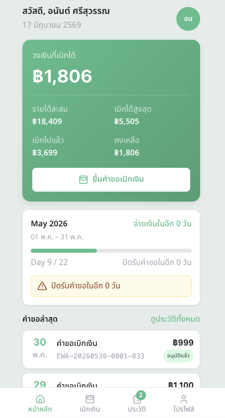
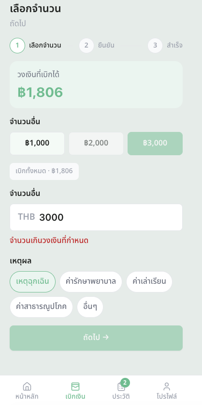
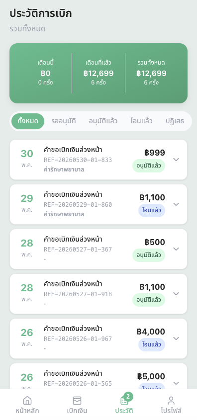
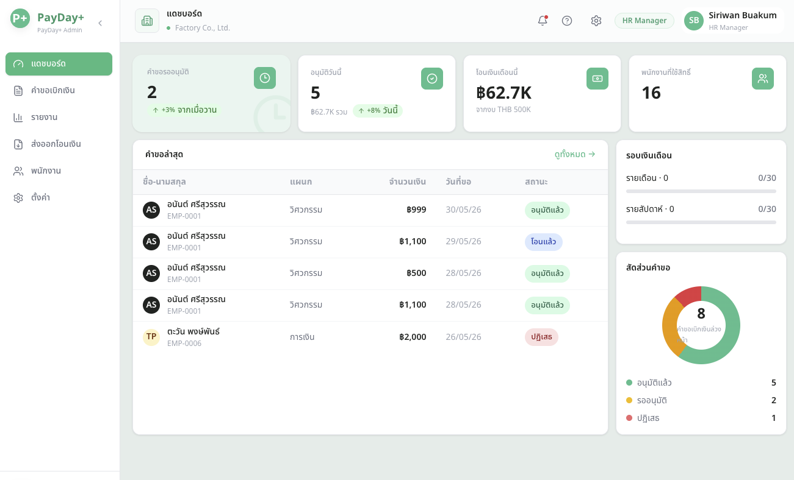
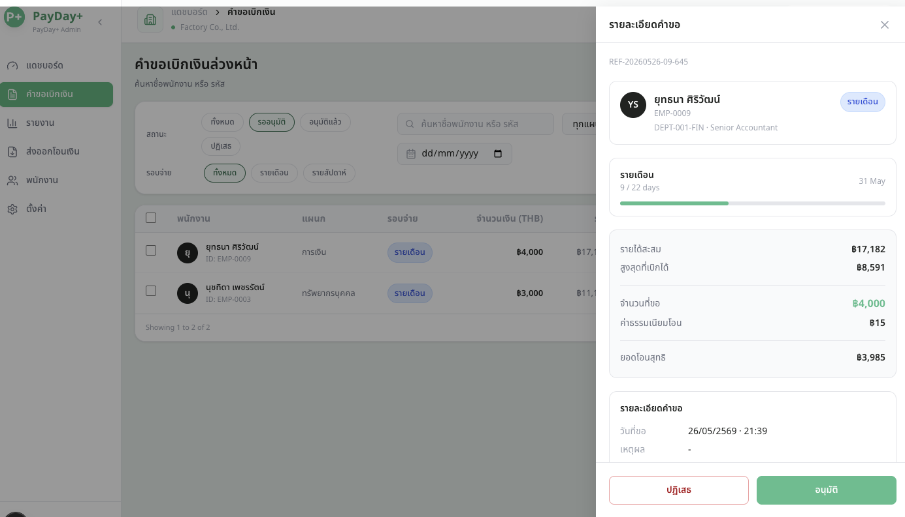

<div align="center">
  
  <h1>PayDay+ LIFF</h1>
  <p>Earned Wage Access platform for factory workers — LINE LIFF frontend</p>

  
  
  
  
</div>

---

## Overview

PayDay+ lets employees request early access to wages they've already earned — directly from LINE, on their phone. HR managers review and approve requests on a desktop dashboard.

| Side | Audience | Viewport |
|---|---|---|
| Employee App | Factory workers | Mobile 390px via LINE LIFF |
| HR Dashboard | HR managers, accountants | Desktop 1440px |

---

## Preview

### Employee App (Mobile · LINE LIFF)

| Home | Request | History |
|---|---|---|
|  |  |  |

### HR Dashboard (Desktop)

| Dashboard | Request List | Reports |
|---|---|---|
|  |  |  |

> Add screenshots to `docs/screenshots/` to populate the preview above.

---

## Features

**Employee (LINE LIFF)**
- LINE OAuth login with auto-link on return
- Balance card with pay-period progress
- 3-step EWA request wizard with PIN confirmation
- Real-time over-limit validation
- Request history with status tabs
- Profile, bank account display, language switcher (TH / EN / MM)
- Offline banner

**HR Dashboard**
- Metrics overview — pending / approved / disbursed / enrolled
- EWA request list with search, filters, bulk approve
- Request detail drawer with employee timeline
- CSV export for bank disbursement
- Accountant report with monthly/weekly view
- Settings — approval chain, max %, blackout dates
- On-behalf request (HR submits for employee, no PIN)

---

## Tech Stack

- **Framework**: Next.js 15 (App Router)
- **Language**: TypeScript
- **Styling**: Tailwind CSS + shadcn/ui
- **LINE**: `@line/liff` SDK
- **i18n**: next-intl — Thai, English, Myanmar
- **Charts**: Recharts
- **Testing**: Vitest + Playwright

---

## Getting Started

### 1. Clone & install

```bash
git clone git@github.com:yanavat/payday-liff.git
cd payday-liff
npm install
```

### 2. Configure environment

```bash
cp .env.example .env.local
# Fill in NEXT_PUBLIC_LIFF_ID and LINE_CHANNEL_ACCESS_TOKEN
```

> Set `NEXT_PUBLIC_LIFF_MOCK=true` to run in browser without a real LINE account.

### 3. Run

```bash
npm run dev
# → http://localhost:3000
```

For LINE LIFF testing on a real device, expose localhost with ngrok and register the URL in [LINE Developer Console](https://developers.line.biz/console/).

---

## Project Structure

```
app/
  (liff)/          # Employee LIFF routes (no locale prefix)
  [locale]/
    (liff)/        # Employee LIFF routes (locale-aware)
    hr/            # HR dashboard routes
components/
  employee/        # Employee-side UI components
  hr/              # HR-side UI components
  ui/              # Shared design system (Avatar, Badge, Table…)
lib/
  api/             # API client + SWR hooks
  auth/            # Session management
  line/            # LINE messaging, webhooks, rich menu
messages/          # i18n strings (th.json, en.json, my.json)
```

---

## Environment Variables

See [`.env.example`](.env.example) for the full list. Key variables:

| Variable | Description |
|---|---|
| `NEXT_PUBLIC_LIFF_MOCK` | `true` to skip LINE auth in browser |
| `NEXT_PUBLIC_LIFF_ID` | LIFF App ID from LINE Developer Console |
| `LINE_CHANNEL_ACCESS_TOKEN` | Channel Access Token (server-side only) |
| `NEXT_PUBLIC_API_BASE_URL` | Backend base URL (default: `http://localhost:4000`) |

---

## Backend

This repo is the **Next.js frontend only**. The backend (NestJS + TypeORM + PostgreSQL) lives in a separate repository. Set `NEXT_PUBLIC_API_BASE_URL` to point to it.

---

## License

MIT
