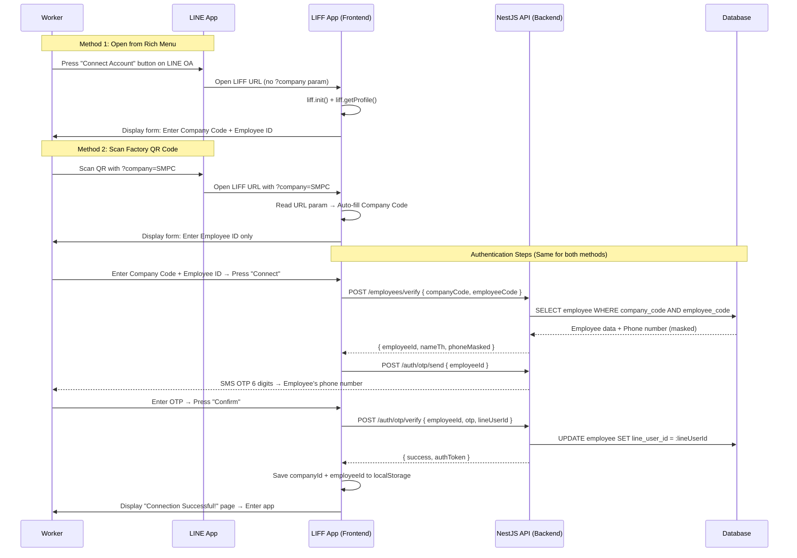

# Multi-Company Employee Onboarding — Implementation Plan

An onboarding system for multiple companies via a single LINE OA account, using **Company Code** as the primary identifier and **Factory QR Code** as a shortcut for auto-filling.

---

## System Architecture (Architecture)



---

## Proposed Changes

### 1. Types & API Layer

#### [MODIFY] [types/index.ts](file:///Users/tavana/dev/wow-2026/payday-liff/types/index.ts)

Add Type for Onboarding Flow:

```diff
+// ── Onboarding ──────────────────────────────────────────────
+
+export type OnboardingStep = 'company_verify' | 'otp_verify' | 'complete'
+
+export interface OnboardingState {
+  step: OnboardingStep
+  companyCode: string
+  employeeCode: string
+  employeeId?: string        // populated after verify
+  employeeName?: string
+  phoneMasked?: string       // e.g. "08x-xxx-1234"
+  companyName?: string
+  lineUserId: string
+}
+
+export interface VerifyEmployeeRequest {
+  companyCode: string
+  employeeCode: string
+}
+
+export interface VerifyEmployeeResponse {
+  employeeId: string
+  nameTh: string
+  phoneMasked: string
+  companyName: string
+  companyId: string
+}
+
+export interface SendOtpRequest {
+  employeeId: string
+}
+
+export interface VerifyOtpRequest {
+  employeeId: string
+  otp: string
+  lineUserId: string
+}
+
+export interface VerifyOtpResponse {
+  success: boolean
+  authToken: string
+  companyId: string
+}
```

---

#### [MODIFY] [lib/api/client.ts](file:///Users/tavana/dev/wow-2026/payday-liff/lib/api/client.ts)

Adjust API Client so `companyId` can be changed at Runtime (not solely dependent on ENV) to support Multi-tenant:

```diff
 class ApiClient {
   private config: ApiClientConfig;

   constructor(config: ApiClientConfig) {
     this.config = config;
   }

+  /** Update company context after onboarding links employee */
+  setCompanyId(companyId: string) {
+    this.config.companyId = companyId;
+  }
+
+  getCompanyId(): string | undefined {
+    return this.config.companyId;
+  }
```

Adjust `getApiClient()` to also read `companyId` from localStorage (fallback from ENV):

```diff
 export function getApiClient(): ApiClient {
   if (!apiClientInstance) {
     const baseURL =
       process.env.NEXT_PUBLIC_API_BASE_URL || "http://localhost:3001";
-    const companyId = process.env.NEXT_PUBLIC_COMPANY_ID;
+    const companyId =
+      (typeof window !== "undefined"
+        ? localStorage.getItem("payday-company-id")
+        : null) ?? process.env.NEXT_PUBLIC_COMPANY_ID;
```

---

### 2. Onboarding Component (New File)

#### [NEW] components/liff-onboarding-page.tsx

Main Component for all 3 steps of the Onboarding Flow:

| Step | UI | Logic |
|---------|-----|-------|
| **Step 1 — Verify Employee Account** | Form to enter Company Code + Employee ID, displaying detected LINE Profile | Read `?company` from URL params to auto-fill Company Code if present → POST `/employees/verify` |
| **Step 2 — Verify OTP** | Form to enter 6-digit OTP + display masked phone number | POST `/auth/otp/send` → POST `/auth/otp/verify` |
| **Step 3 — Connection Successful** | Employee information summary + "Enter App" button | Save `companyId`, `employeeId`, `authToken` to localStorage |

```typescript
// Pseudo-code structure
"use client";

export function LiffOnboardingPage({ lineProfile, onComplete }: Props) {
  const [step, setStep] = useState<OnboardingStep>('company_verify')
  const searchParams = useSearchParams()
  const companyFromQR = searchParams.get('company') ?? ''  // ← QR Code shortcut

  // Step 1: Verify company + employee
  async function handleVerify(companyCode: string, employeeCode: string) {
    const result = await api.post<VerifyEmployeeResponse>(
      '/employees/verify',
      { companyCode, employeeCode }
    )
    // Store result → move to OTP step
  }

  // Step 2: Send & verify OTP
  async function handleOtpVerify(otp: string) {
    const result = await api.post<VerifyOtpResponse>(
      '/auth/otp/verify',
      { employeeId, otp, lineUserId: lineProfile.userId }
    )
    // Save authToken + companyId → move to complete
  }

  // Step 3: Done → save to localStorage → call onComplete()
}
```

---

### 3. Auth Gate Integration

#### [MODIFY] [components/liff-auth-gate.tsx](file:///Users/tavana/dev/wow-2026/payday-liff/components/liff-auth-gate.tsx)

Adjust `AuthGate` to use `LiffOnboardingPage` instead of the old linking form:

```diff
 // Change from single Employee ID form...
 if (authState === "linking") {
-    return (
-      <main className="employee-screen p-5">
-        <h1 className="text-2xl font-semibold">{t("linkTitle")}</h1>
-        ...simple form...
-      </main>
-    );
+    return (
+      <LiffOnboardingPage
+        lineProfile={profile!}
+        onComplete={(companyId, employeeId) => {
+          saveLinkedEmployee(lineUserId, employeeId, companyId);
+          setAuthState("ready");
+        }}
+      />
+    );
 }
```

Adjust storage helper to also store `companyId`:

```diff
-const EMPLOYEE_LINKS_STORAGE_KEY = "payday-liff-employee-links";
+const EMPLOYEE_LINKS_STORAGE_KEY = "payday-liff-employee-links";
+const COMPANY_ID_STORAGE_KEY = "payday-company-id";

-function saveLinkedEmployeeId(lineUserId: string, employeeId: string) {
+function saveLinkedEmployee(lineUserId: string, employeeId: string, companyId: string) {
   const links = readEmployeeLinks();
   links[lineUserId] = employeeId;
   localStorage.setItem(EMPLOYEE_LINKS_STORAGE_KEY, JSON.stringify(links));
+  localStorage.setItem(COMPANY_ID_STORAGE_KEY, companyId);
 }
```

---

### 4. Backend API Endpoints (NestJS)

> [!IMPORTANT]
> These endpoints need to be further developed in the `../payday-backend/` repo.

#### [NEW] POST `/employees/verify`

Verify Company Code + Employee Code:

```typescript
// Request Body
{ companyCode: "SMPC", employeeCode: "EMP-0001" }

// Response 200
{
  employeeId: "uuid-...",
  nameTh: "นายสมชาย ดีใจ",
  phoneMasked: "08x-xxx-1234",
  companyName: "SMPC Factory Ltd.",
  companyId: "company-uuid-..."
}

// Response 404 → Employee not found in this company
{ message: "Employee not found", statusCode: 404 }
```

#### [NEW] POST `/auth/otp/send`

Send 6-digit OTP to employee's phone number:

```typescript
// Request Body
{ employeeId: "uuid-..." }

// Response 200
{ sent: true, expiresInSeconds: 300 }
```

#### [NEW] POST `/auth/otp/verify`

Verify OTP + Save LINE User ID to database:

```typescript
// Request Body
{ employeeId: "uuid-...", otp: "123456", lineUserId: "U102938..." }

// Response 200
{ success: true, authToken: "jwt-token-...", companyId: "company-uuid-..." }

// Response 401 → Invalid or expired OTP
{ message: "Invalid or expired OTP", statusCode: 401 }
```

---

### 5. i18n Translation Keys

#### [MODIFY] messages/th.json, en.json, my.json

Add new `onboarding` Namespace to all 3 language files:

```json
"onboarding": {
  "stepIndicator": "Step {current} of {total}",

  "step1Title": "Connect Employee Account",
  "step1Description": "Verify employee ID to link your LINE account with the company's expense claim privileges.",
  "companyCodeLabel": "Company Code",
  "companyCodePlaceholder": "e.g. SMPC, CPALL",
  "companyCodeAutoFilled": "Auto-filled from factory sign",
  "employeeCodeLabel": "Employee ID",
  "employeeCodePlaceholder": "e.g. EMP-0001",
  "verifyButton": "Connect Employee Account",
  "verifyError": "Employee account not found with the provided company code and employee ID.",

  "step2Title": "Verify Security Code (OTP)",
  "step2Description": "Enter the 6-digit verification code we sent to {phone}.",
  "otpLabel": "6-digit OTP",
  "otpPlaceholder": "000000",
  "otpButton": "Verify Security Code",
  "otpError": "Invalid or expired OTP. Please try again.",
  "otpResend": "Resend Code",

  "step3Title": "Connection Successful!",
  "step3Description": "Your LINE account has been successfully linked to the PayDay+ expense claim system.",
  "summaryCompany": "Company",
  "summaryEmployeeId": "Employee ID",
  "summaryName": "Employee Name",
  "summaryPayCycle": "Pay Cycle",
  "enterAppButton": "Enter App Home Page",

  "lineConnected": "LINE Connected"
}
```

---

### 6. Employee Links (Server-Side)

#### [MODIFY] [lib/line/employee-links.ts](file:///Users/tavana/dev/wow-2026/payday-liff/lib/line/employee-links.ts)

Adjust Mock store to also store companyId:

```diff
-const serverLinks: Record<string, string> = { ... }
+interface EmployeeLink {
+  employeeId: string;
+  companyId: string;
+}
+const serverLinks: Record<string, EmployeeLink> = {
+  'mock-line-user': { employeeId: 'EMP-0001', companyId: 'company-smpc' },
+  ...
+}

-export function linkEmployee(lineUserId: string, employeeId: string): void {
+export function linkEmployee(lineUserId: string, employeeId: string, companyId: string): void {
-  serverLinks[lineUserId] = employeeId;
+  serverLinks[lineUserId] = { employeeId, companyId };
 }
```

---

## Verification Plan

### Unit Tests

#### [NEW] components/liff-onboarding-page.test.tsx

| Test Case | Description |
|-----------|----------|
| `renders step 1 form with company code and employee id inputs` | Verify that Step 1 displays 2 input fields + connect button |
| `auto-fills company code from URL ?company=SMPC` | Simulate URL param → Verify that company input is auto-filled + disabled |
| `shows auto-fill tag when company comes from QR` | Verify that the "Auto-filled from factory sign" badge is displayed |
| `disables submit button when inputs are empty` | Button should be disabled when not all fields are filled |
| `shows error when employee not found` | Simulate API 404 → Verify that error message is displayed |
| `transitions to step 2 on successful verify` | Simulate API 200 → Verify transition to OTP step |
| `displays masked phone number in step 2` | Verify that the masked phone number is displayed correctly |
| `validates OTP length is exactly 6 digits` | Verify that the OTP confirm button is enabled when 6 digits are entered |
| `shows error on invalid OTP` | Simulate API 401 → Verify that error message is displayed |
| `transitions to step 3 and shows summary on success` | Simulate successful OTP → Verify that summary is displayed |
| `calls onComplete with companyId and employeeId` | Verify that the callback is called with correct values |
| `saves companyId to localStorage after completion` | Verify that localStorage contains `payday-company-id` key |

#### [MODIFY] components/liff-auth-gate.test.tsx

| Test Case | Description |
|-----------|----------|
| `renders LiffOnboardingPage when authState is linking` | Verify that the new Onboarding component is used instead of the old form |
| `passes lineProfile to onboarding component` | Verify that the `lineProfile` prop is passed correctly |

---

### Interactive HTML Demo

An HTML file for testing the Onboarding Flow logic interactively has been created at:

📂 [multi_company_onboarding_demo.html](file:///Users/tavana/.gemini/antigravity/brain/5593611b-8f89-489b-9682-0e7dc8eb63bc/scratch/multi_company_onboarding_demo.html)

Demo Features:
- **Left Control Panel:** Simulate URL events (Rich Menu vs QR Code) + display mock database.
- **Right Mobile Screen:** Simulate a 390px interactive LIFF screen with all 3 steps.
- **Testable:** Enter `SMPC` + `EMP-0001` → OTP `000000` → See successful result.
- **Test Error:** Enter incorrect company code or employee ID → Display error message.

> [!TIP]
> Open this HTML file directly in a browser to test the logic immediately without building the project.

---

## Related Files Summary

| Action | File | Description |
|---------|------|----------|
| **MODIFY** | [types/index.ts](file:///Users/tavana/dev/wow-2026/payday-liff/types/index.ts) | Add Onboarding Types (5 interfaces) |
| **MODIFY** | [lib/api/client.ts](file:///Users/tavana/dev/wow-2026/payday-liff/lib/api/client.ts) | Add `setCompanyId()` + read companyId from localStorage |
| **NEW** | `components/liff-onboarding-page.tsx` | Main 3-step Onboarding Wizard Component |
| **MODIFY** | [components/liff-auth-gate.tsx](file:///Users/tavana/dev/wow-2026/payday-liff/components/liff-auth-gate.tsx) | Change linking page → use LiffOnboardingPage |
| **MODIFY** | [lib/line/employee-links.ts](file:///Users/tavana/dev/wow-2026/payday-liff/lib/line/employee-links.ts) | Add companyId to link structure |
| **MODIFY** | `messages/th.json`, `en.json`, `my.json` | Add `onboarding` namespace (19 keys) |
| **NEW** | `components/liff-onboarding-page.test.tsx` | Unit tests (12 test cases) |
